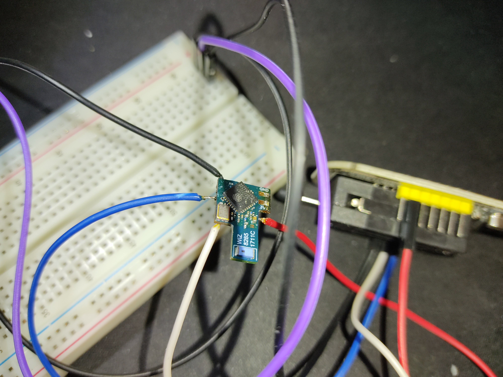
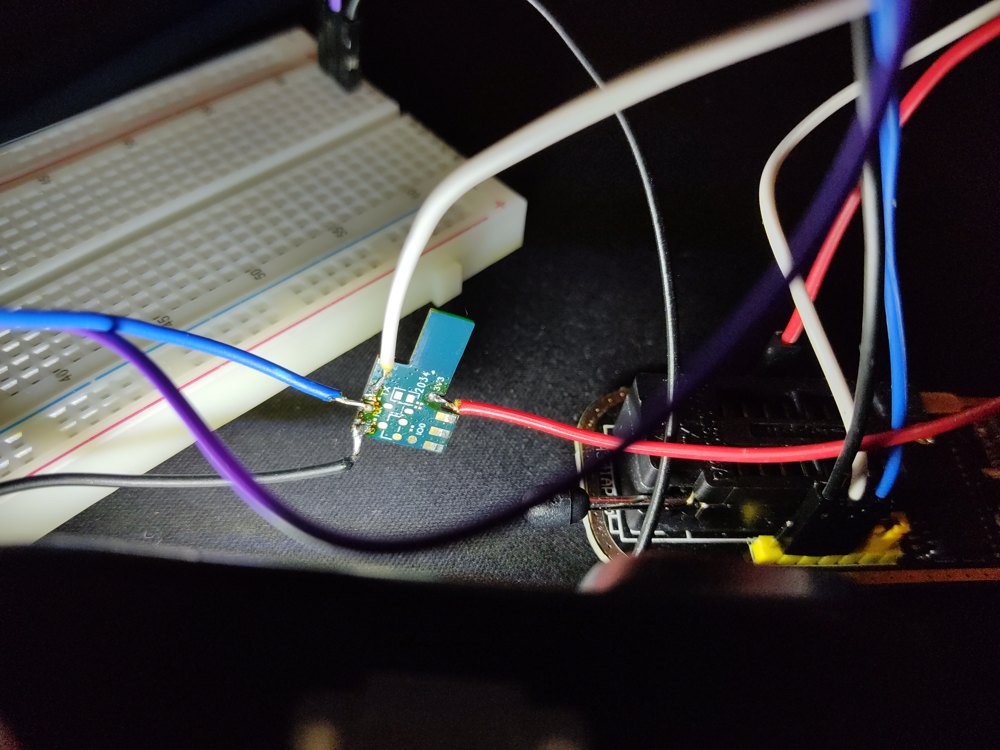

# WIZ E14 Lightbulb // Gauss 1110112 

## Hardware

SoC: WIZ 8285-1711C board (ESP8266) internal 1MB Flash

Pins:
 - IO0: Programming Mode

## Firmware

Dumping the firmware requires a full (and quite destructive) disasembly of the lighbulb case, followed by unsoldering the wiz board from the power board an soldering a couple of cables to the UART pins. Reading (and possibly writing) of the firmware is possible. 
The stock firmware is unencrypted and contains Wi-Fi SSIDs and passwords (even after unpairing it from the WiZ app!) and firmware download URLs.
The firmware contains a few outdated certificates, and it appears that they are also used for getting the firmware from WiZs' servers. There's a public key, presumably for fimware signature verification. The firmware image has been edited to remove Wi-Fi credentials.
Further analysis is still pending.

