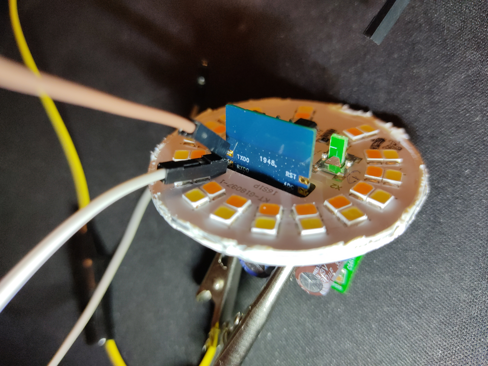
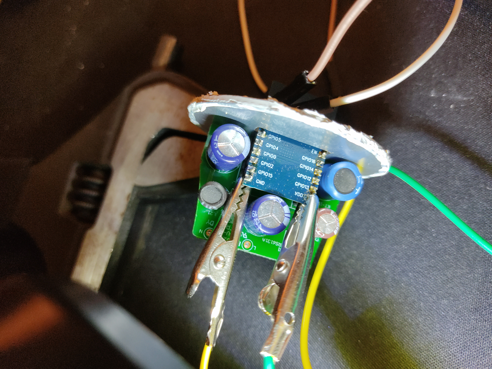

# WIZ E27 Lightbulb // Gauss 1080112 

## Hardware

SoC: WIZ 8285-2416P board (ESP8285) internal 1MB Flash

Pins:
- RST: External reset signal (Low voltage level: Active)
- AD: ADC pin (Connected to internal WiZclick circuit)
- EN: Enable pin (Internal pull up), active high.
- GPIO16: GPIO16 (Connected to internal WiZclick circuit)
- GPIO14: GPIO14, PWM output for LED driver (B)
- GPIO12: GPIO12, PWM output for LED driver (R)
- GPIO13: GPIO13, PWM output for LED driver (CW)
- VDD: Power input for the module 3.3V
- GND: Power Ground
- GPIO15: GPIO15 (10K internal pull-low added), PWM output for LED driver (G)
- GPIO2: GPIO2
- GPIO0: Programming Mode
- GPIO4: GPIO4, PWM output for LED driver (WW)
- GPIO5: GPIO5 (or IR)
- RXD0: UART\_Rx; GPIO3
- TXD0: UART\_Tx; GPIO1

## Firmware

Dumping the firmware requires a full (and quite destructive) teardown of the lighbulb case, however no (de)soldering is required to access the UART pins. Reading (and possibly writing) of the firmware is possible. 
The stock firmware is unencrypted and contains Wi-Fi SSIDs and passwords (even after unpairing it from the WiZ app!) and firmware download URLs.
The firmware contains a few outdated certificates, and it appears that they are also used for getting the firmware from WiZs' servers. There's a public key, presumably for HPKP. The firmware image has been edited to remove Wi-Fi credentials.
Further analysis is still pending.

