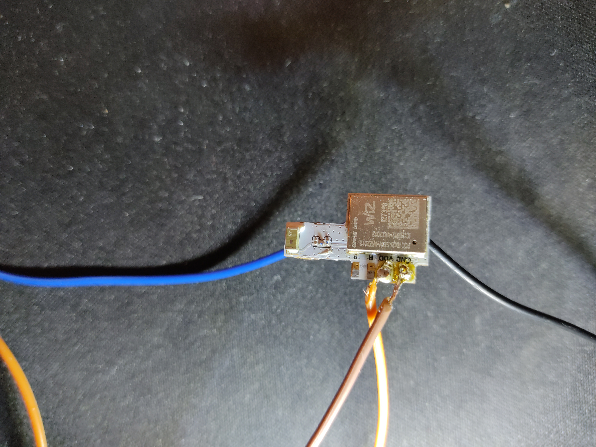
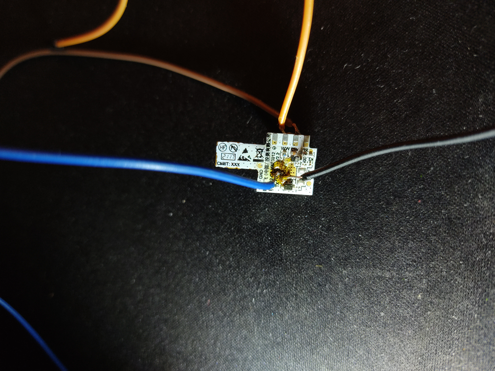

# WIZ E14 Lightbulb // 929002448702

## Hardware

SoC: ESP32-C3-WIZ2012 board (ESP32-C3) internal 4MB Flash

Pins:
- B (IO5) Not used
- R (IO6) Not used
- VDD Power input for the module 3.3V
- GND Power Ground
- G (IO4) Not used
- WW (IO7) PWM output for CCT control PWM output for WW LED Not used
- CW (IO10) PWM output for DIM control PWM output for CW LED PWM output for LED
- GPIO (IO18) Auxiliary GPIO
- TX UART download mode Tx
- RX UART download mode Rx
- BOOT UART download mode

## Firmware

Dumping the firmware requires a full (and quite destructive) teardown of the lighbulb case, followed by unsoldering the wiz board from the power board an soldering a couple of wires to the UART pins. Reading (and possibly writing) of the firmware is possible. The stock firmware is encrypted using AES-256-XTS, however Secure Boot is disabled. Theoretically, it's possible to perform [fault injection](https://courk.cc/esp32-c3-c6-fault-injection#introduction) and/or [side channel](https://courk.cc/breaking-flash-encryption-of-espressif-parts#attacking-the-esp32-c3_1) attacks on ESP32-C3 in order to decrypt the firmware.
Further analysis is still pending.

